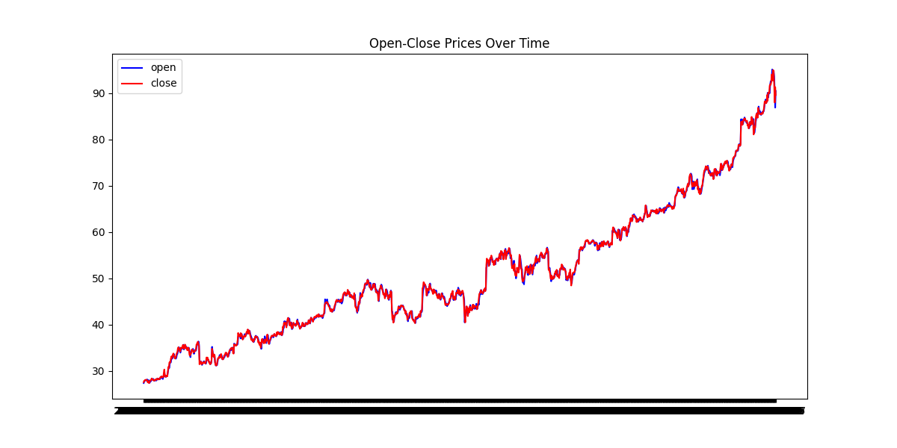
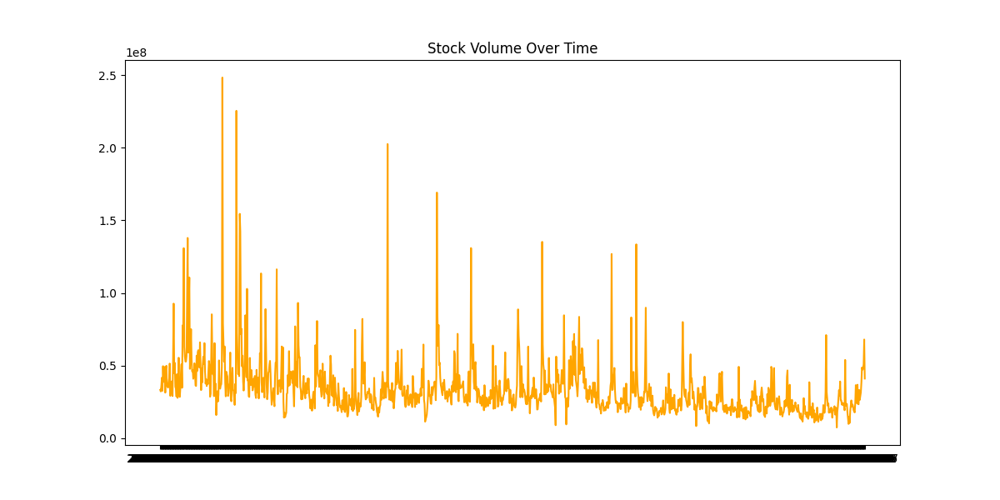
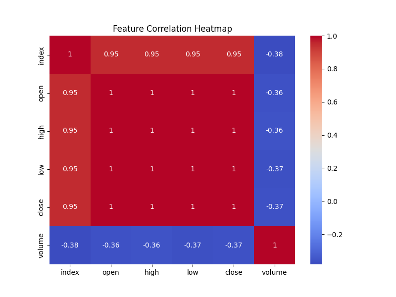
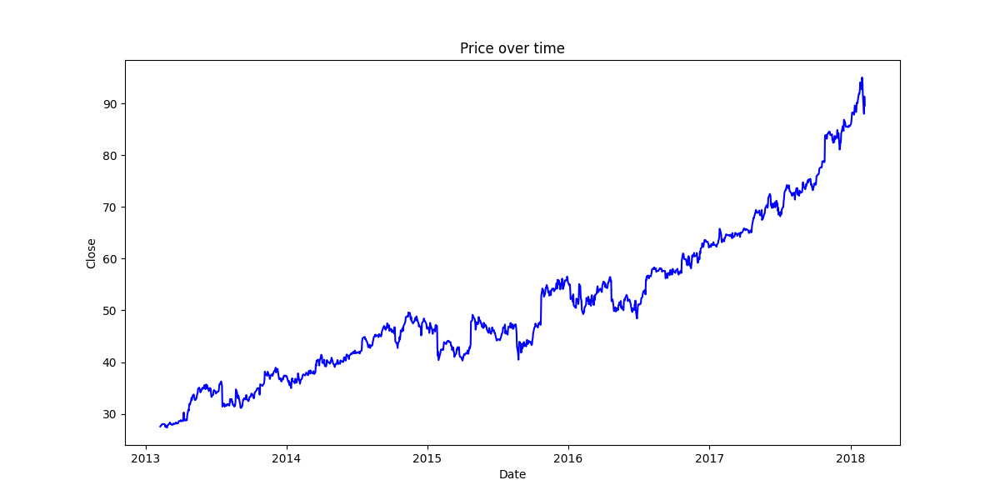
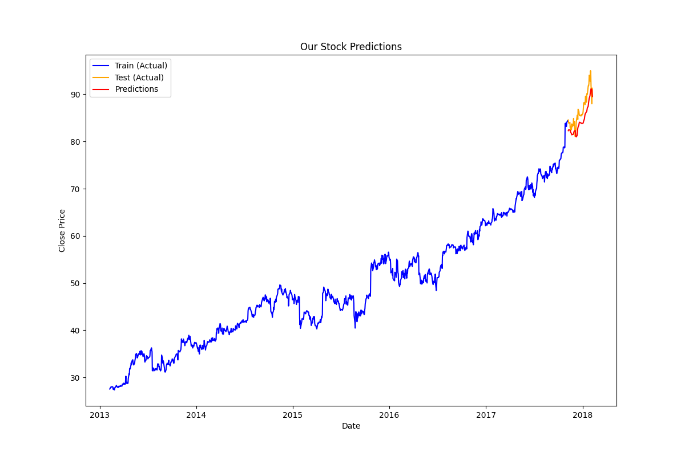

# LSTM Stock Price Prediction

This project predicts **Microsoft stock prices** using a **LSTM (Long Short-Term Memory)** model.  
It is built with **Python**, **TensorFlow/Keras**, and data visualization with **Matplotlib** and **Seaborn**.

---

## Project Structure

LSTM-STOCK-PREDICTION/
├── main.py
├── MicrosoftStock.csv
├── plots/
│   ├── open_close_prices.png
│   ├── volume_over_time.png
│   ├── feature_correlation.png
│   ├── price_over_time.png
│   └── predictions_vs_actual.png
└── requirements.txt


---

## How it works

1. **Data Loading & Exploration**:  
   Load Microsoft stock data (`MicrosoftStock.csv`) and perform basic EDA (head, info, description).

2. **Visualization**:  
   - Open vs Close Prices  
   - Trading Volume  
   - Feature Correlation Heatmap  
   - Price over Time  

3. **Data Preprocessing**:  
   - Scale data using `StandardScaler`  
   - Create sliding window dataset for LSTM (60 days)

4. **Model Architecture**:  
   - Two LSTM layers  
   - Dense layer with 128 neurons  
   - Dropout layer (0.5)  
   - Output Dense layer (1 neuron for stock price)

5. **Training**:  
   - 20 epochs, batch size 32  
   - Metrics: MAE & RMSE

6. **Prediction & Plotting**:  
   - Test set predictions  
   - Compare predictions with actual stock prices  
   - Save all plots in the `plots/` folder

---

## Example Plots

### Open vs Close Prices


### Trading Volume


### Feature Correlation Heatmap


### Price over Time


### Predictions vs Actual


---

## How to Run

1. Clone this repo:

```bash
git clone <your_repo_url>
cd LSTM-STOCK-PREDICTION


2. Install dependencies:

pip install -r requirements.txt

3. Run the model:

python main.py

---

Tech Stack

Python 3.x
TensorFlow / Keras
Pandas, Numpy
Matplotlib, Seaborn
Scikit-learn

Author

Prathmesh Bunde
Stock Prediction Projects | ML Enthusiast | Python Developer
